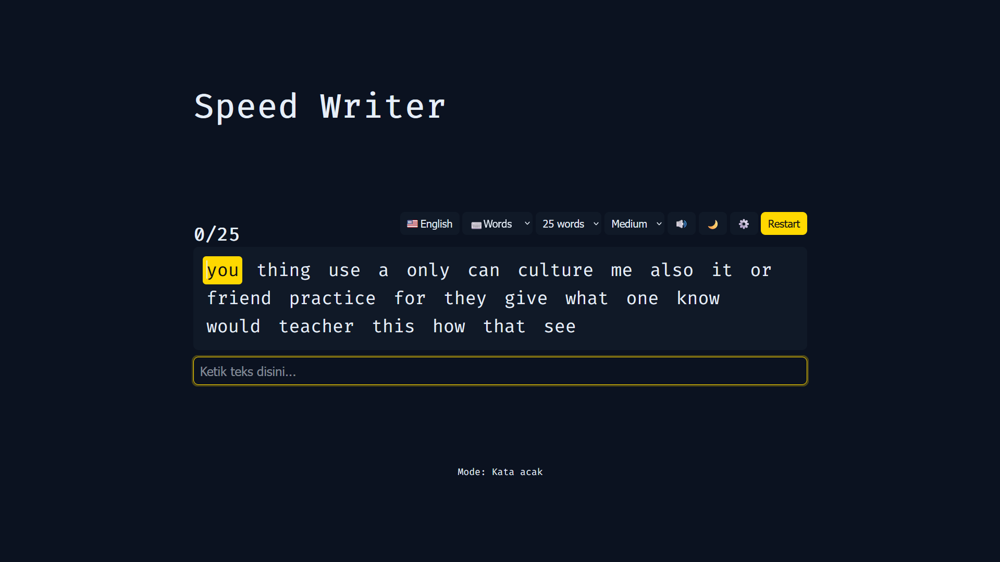

# Speed Writer Touch Typing
Simple and minimal typing test. Practice and test your speed

Visit the webpage: https://DevNoval.github.io/SpeedWriter

list of all update and version

# Pre-release

## 0.1 - 12.09.25
- Remaked the website from start
- Renamed the website from Script Kiddie to Speedy Typist

## 0.2 - 13.09.25
- Added quotes and words mode
- Added dark theme
- Added input highlight when typing (correct: green; incorrect: red)

## 0.3 - 19.09.25
- Added Caret
- Added languages option (English & Indonesia)
- Improvised input handling for typo

## 0.4 - 27.09.25
- Bug fixes
  1. Fixing misplace caret
  2. Fixing function for handling space
  3. Fixing scoreboard for more accurate WPM speed and Accuracy percentage  

## 0.5 - 28.09.25
- Added saving preferences feature with Local Storage
- Moved word data to JSON file

## 0.6 - 01.10.25
- Added highlight score and input when user finished typing
- Play audio when typing
- Play audio when typo
- Play audio when user finished typing

## 0.7 - 03.10.25
- Added Timer mode

## 0.8 - 11.10.25
- Bug Fixes
  1. Fixing Error in timer mode
  2. Fixing input function in timer mode

## 0.9 - 19.10.25
- Added help button for typing tips
- Added total count selection for words and timer mode

# Full Release

## 1.0 - 22.10.25
- Renamed the website from Speedy Typist to Speed Writer
- All settings were moved to settings panel beside restart button
- Input are disabled when user finished typing
- Added more words to JSON file

## 1.1 - 29.10.25
- Added font size selection for readability
- Redesign the web layout
- Adjusting the settings panel
- Added Icon in tab
- Rewrited the code to look more organized
- Added more words to JSON file

## 1.2 - 7.11.25
- Added smooth caret
- Increase font size for readability
- Scoreboard are now hidden and only visible after finish typing
- Improvise layout
- Added more words to JSON file

## 1.3 - 28.11.25
- Added Homepage
- Responsive layout for different screen
- Added Settings and Tutorial to homepage
- Bug fixes
- Added more words to JSON file

## 1.4 - 26.12.25
- Fix some bug in scoreboard
- Fix settings not showing in homepage
- Remove help button
- Improvise tutorial page
- Small UI Changes
- Added more words to JSON file
- Organizing file structures
